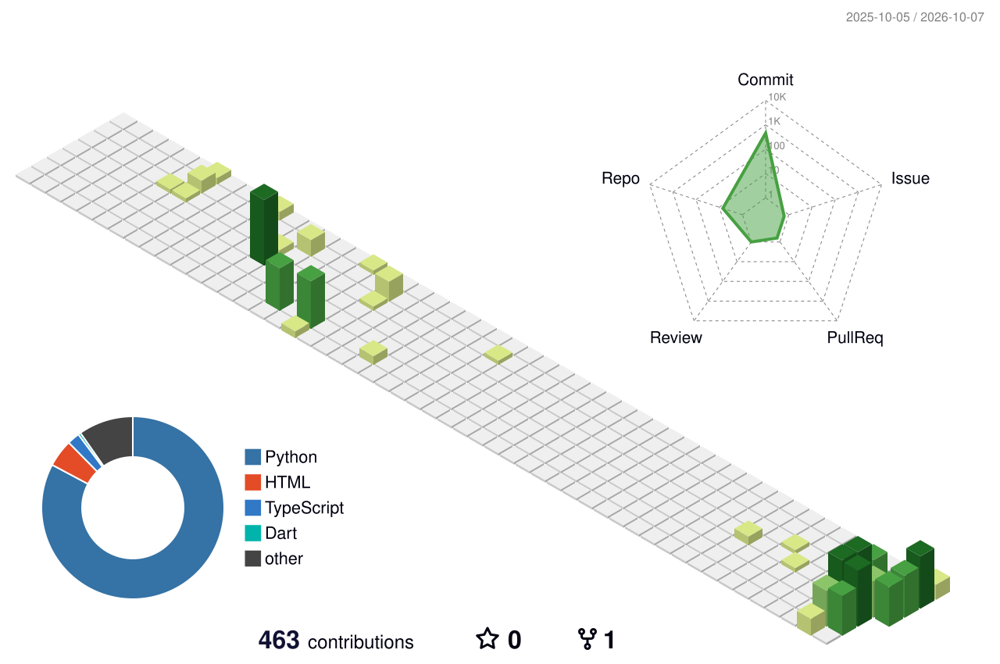

# 💫 Kwon Min-seok (Calcifer)

  

  

## 👤 About Me
<table width="100%">
  <tr>
    <td width="60%">
      <ul>
        <li>🎓 <b>Major:</b> Industrial Engineering (Focus on Optimization & Data)</li>
        <li>🤖 <b>AI Engineering:</b> Developing AI Agents & Machine Learning Models</li>
        <li>📊 <b>Data Analysis:</b> Extracting insights from complex financial/crypto datasets</li>
        <li>🌐 <b>Blog:</b> <a href="https://kwonminseok242.github.io/">kwonminseok242.github.io</a></li>
        <li>💻 <b>Current:</b> Strengthening CS fundamentals & preparing for Softeer Bootcamp</li>
      </ul>
    </td>
    <td width="40%" align="center">
      
    </td>
  </tr>
</table>

---

## 🛠️ Tech Stack & Tools

### 🧪 AI & Data Engineering

  
  
  
  
  

### 🏗️ Backend & Dev-Tools

  
  
  
  
  
  

### 📱 Cross-Platform & App

  
  
  

---

## 🌿 3D Contribution Graph

---

## 📊 Stats & Streaks

  
  

  

---

## 📫 Connect with me

  
  
  

 

<i>"Optimization-driven AI Engineer, bridging the gap between Data and Efficiency."</i>

